# O que é o Postman?

O Postman é uma ferramenta que dá suporte à documentação das requisições feitas pela API, ou seja, permite a criação de requisições HTTP personalizadas. Possui ambiente para a documentação, execução de testes de APIs e requisições em geral.

**Teste de APIs** oferece um ambiente para testar as APIs, possibilitando a validação de respostas e a automação de testes.

**Ambientes** Possibilita a configuração de ambientes, permitindo alternar entre diferentes conjuntos de variáveis e configurações de forma fácil e rápida.

# Como funciona?

Quando abrimos o Postman teremos um ambiente com mais ou menos essa visualização:

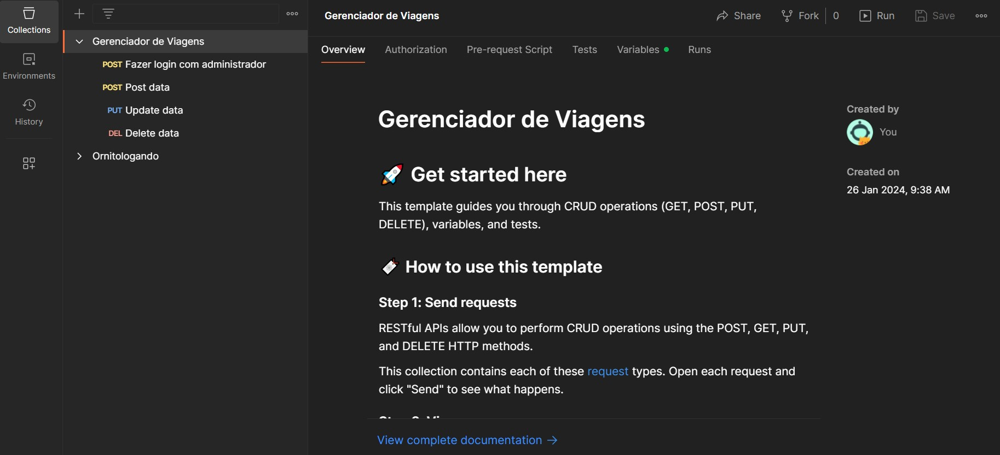 

É possível criar uma nova Collection clicando no + do lado esquerdo do input de pesquisa de colections.

Depois de criar uma nova Collection, é possível criar novas requests nos três pontos ao lado do nome da Collection e em Add request:

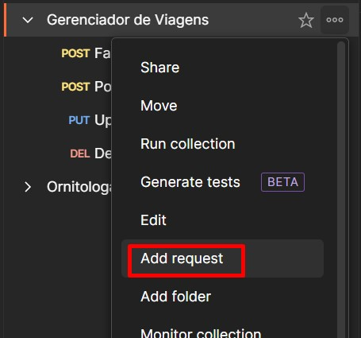 

Ao clicar, aparecerá uma nova aba onde será possível preencher os campos de informações da request. O primeiro é o método a ser escolhido: POST, GET, PUT DELETE. Ao lado o caminho para a requisição.

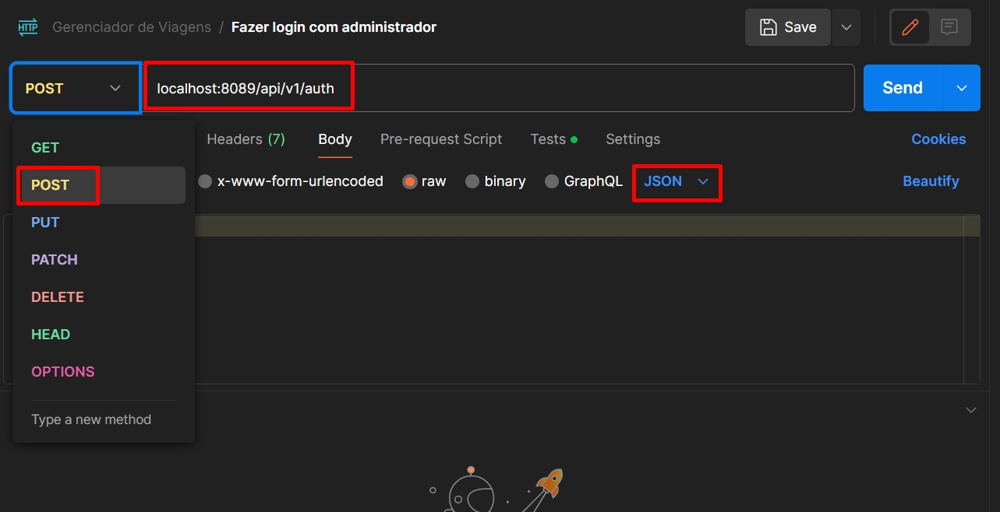 

**Lembrando que é possível checar as informações na documentação da API (no caso desse exemplo é o Swagger):

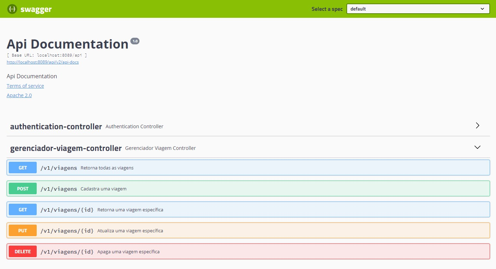 

Logo abaixo é possível inserir o Body, selecionando o tipo, por exemplo JSON e em seguida completando com as informações a serem enviadas na requisição. Para enviar, é só clicar em "Send".

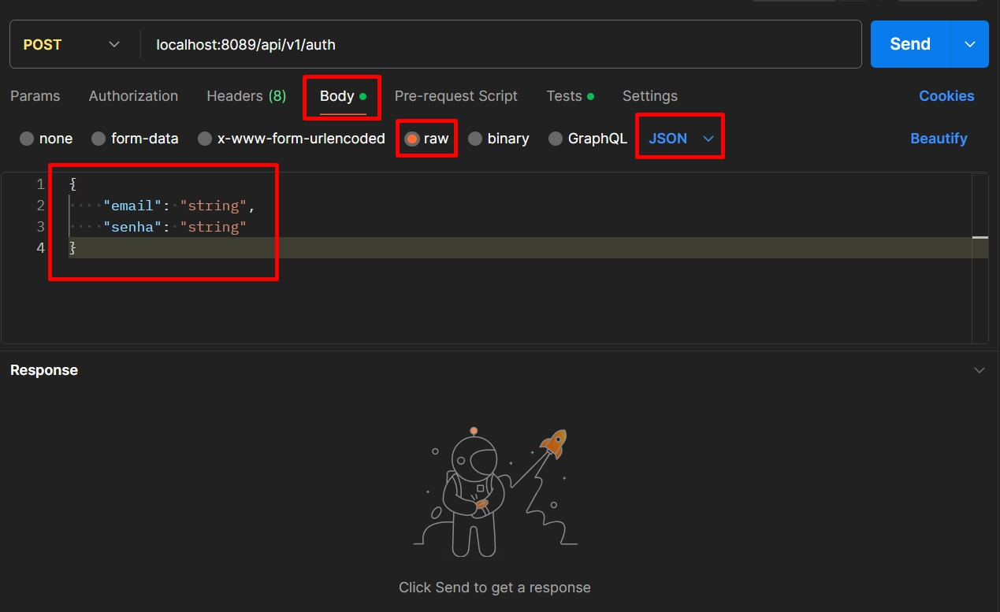 

É possível criar uma variável fixa para o endereço base da aplicação selecionando o endereço e clicando em "Set as a variable" ou clicando em Environments > Globals.

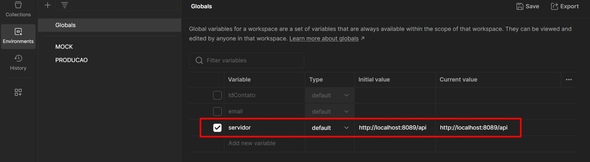 

Para selecionar a variável global no endereço, é só colocar o nome da variável entre chaves:

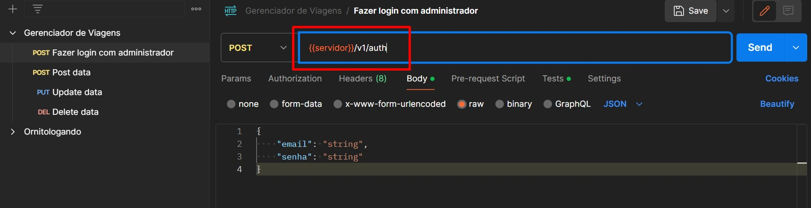 

Também é possível criar uma variável global para o token. Para isso, é necessário criar a variável da mesma maneira que explicado acima, porém, com o token muda a cada acesso, os campos de valores ficam vazios.

Em seguida, é necessáriop ir ao requerimento de autenticação, selecionar a aba Tests, criar uma const para a resposta como na imagem abaixo, clicar em "Set a global variable" e dentro colocar o nome da variável global entre aspas e a const como na imagem abaixo.

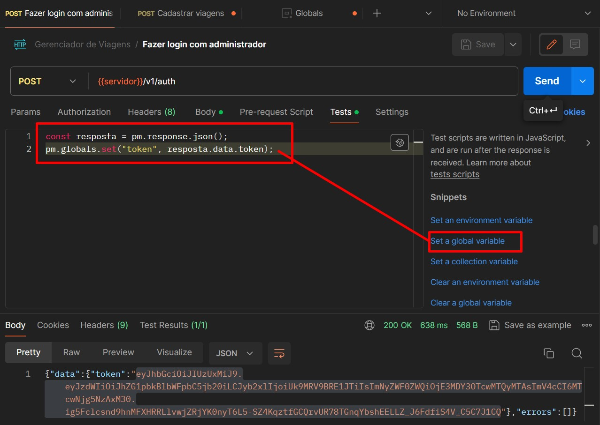 

Então, em cada request que for feito é possível colocar a variável global token em Headers > Authorization para não precisar trocar manualmente a cada nova autenticação.

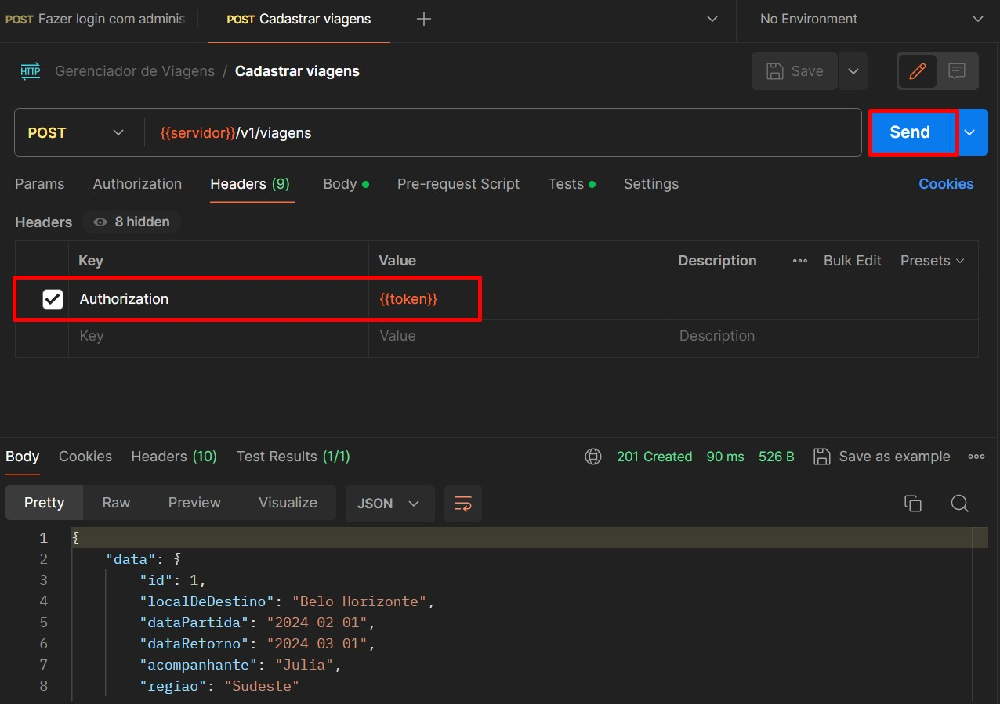 

Na aba "Tests" é possível criar scripts que serão executados após o recebimento da resposta da execução do teste.

Dito isso, para finalizar, é possível criar Scripts de testes para garantir que o response seja o esperado pela aplicação:

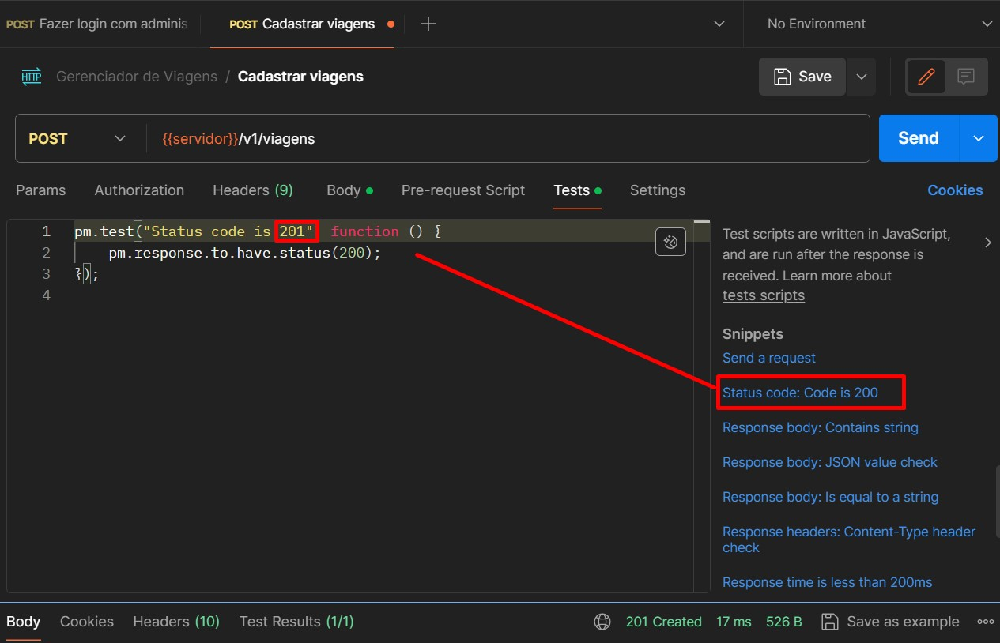

E caso o resultado do teste depois do response, nesse caso afirmativo:

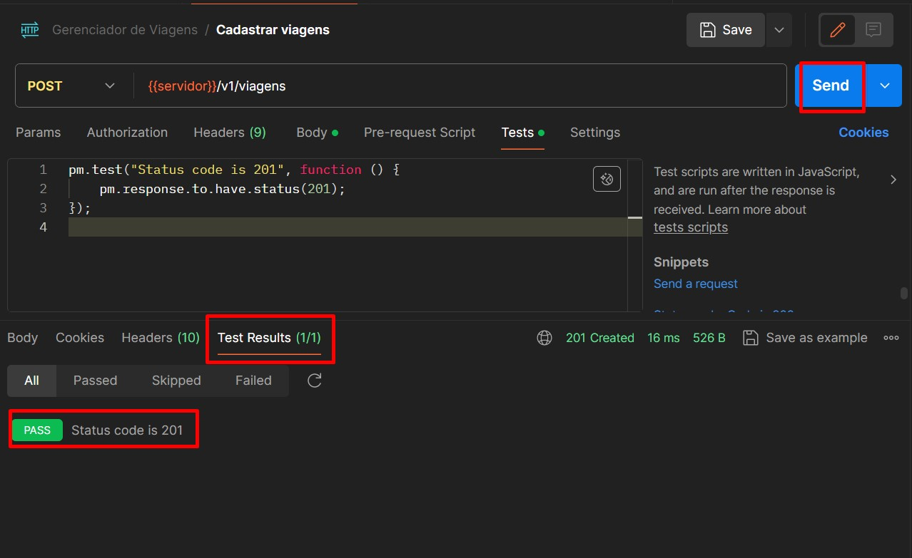  

# Como importar uma API por JSON do Swagger

Clicar em ... e Import:   
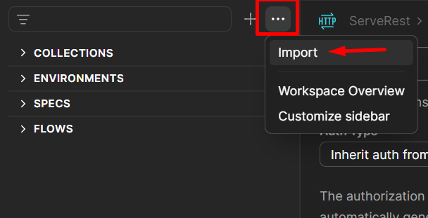

Colar link de json do Swagger:   
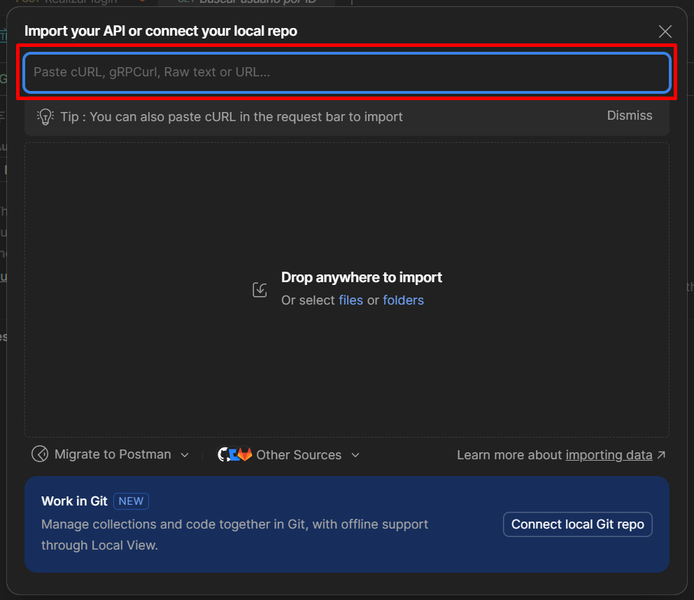

Onde encontrar o link do Json na página Swagger de documentação da API:   
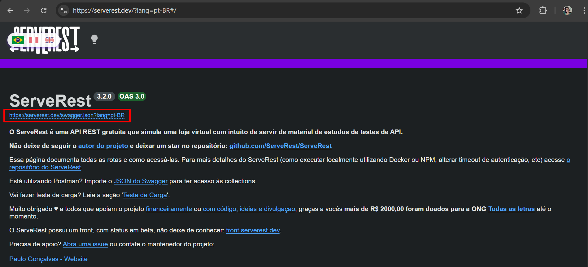

Conteúdo do link de Json do Swagger:   
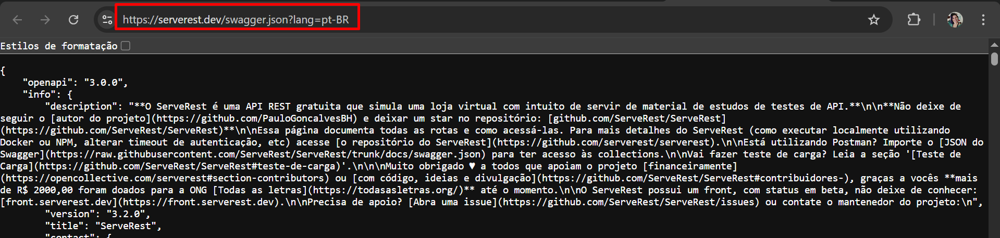

Após colar link na tela da imagem 2, selecionar Postman Collection e Import:   
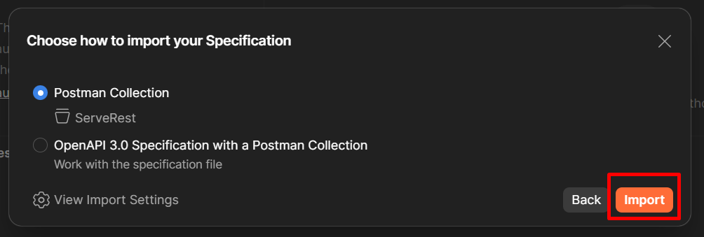

Resultado da Collection após import:   
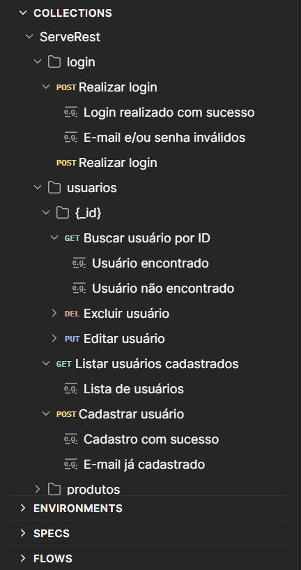